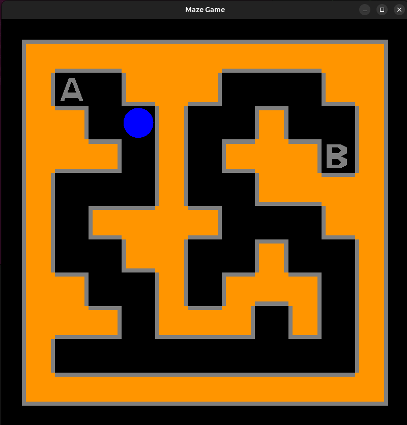

# Problema3: Laberinto2D
Usando la solución del **problema 2** dibujar el laberinto 2D usando una librería de gráficos en C++ como OpenGL, DirectX, SDL o similares.

No se aceptarán soluciones que usen librerías para interfaces de usuario como: Qt, wxWidgets, MFC, Windows Forms, etc.

Agregar la navegación de un carácter de forma circular en el laberinto controlable por el usuario usando las teclas AWSD.
Implementar la función: drawMaze2D()

## Build
Para generar el ejecutable, ubicarse a la altura del archivo Makefile y ejecutar el comando make

    make
Para ejecutar, ubicarse dentro de la carpeta exec

    ./run

## Resultados

[video here](https://youtu.be/G9W5ZZFAmH4)
## Notes
Este proyecto se realizó con openGL moderno(4.6 core-profile) usando shaders.
Para el manejo de periféricos y ventanas se uso [GLFW](https://www.glfw.org/) adicionalmente [glad](https://glad.dav1d.de/).
Para el uso de vectores y matrices homogeneas se usó [glm](https://glm.g-truc.net/0.9.8/index.html).

Renderizado: 

No se usó texturas, el laberinto, el círculo y las letras A y B son completamente generadas a partir de un array de posiciones y colores.

El renderizado del laberinto se hizo a partir de 5 tipos de piezas que con transformaciones de escalamiento, rotación y traslación forman el laberinto.

Como el laberinto y las letras A(start) y B(final) no cambian durante cada renderizado se optó por renderizarse fuera de pantalla guardandolo en un frame buffer object y usandolo como textura cuando se renderiza en pantalla. Esto elimina el trabajo repetitivo de construir el laberinto y las letras A y B cada vez que se renderice. Una vez obtenida esta información como textura se borran los VBO VAO del laberinto y de las letras. liberando asi espacio en la memoria de la GPU.
