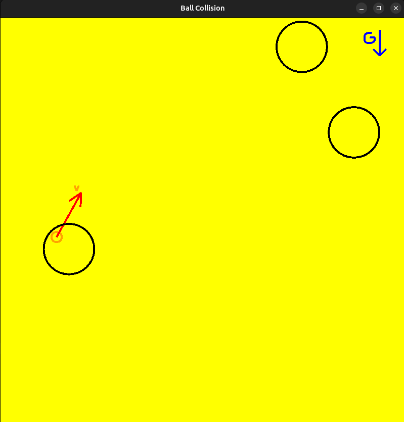

# Problema4: FISICA
Cree un simulador para disparar pelotas circulares. Considerar por simplicidad un cuarto rectangular cerrado y de gravedad **G**. Las pelotas son círculos que deben de chocar contra las paredes y entre ellas, luego de un tiempo de estar inmóviles deben desaparecer. 

Para este problema considere coeficientes de fricción y elasticidad convenientes y demás suposiciones que cree necesarias y comentarlas en su código. Su programa debe permitir mover el origen de disparo **O** y la velocidad y angulo inicial de disparo **V**. Las pelotas deben ser lanzadas al apretar la tecla de espacio. **No usar librerías físicas existentes**, pero puedes usar cualquier librería de gráficos **realtime** existente, como SDL2, SFML, OpenGL, etc.

Implementar la función: **shootBall()**
## Build
Para generar el ejecutable, ubicarse a la altura del archivo Makefile y ejecutar el comando make

    make
Para ejecutar, ubicarse dentro de la carpeta exec

    ./run

## Resultados

[video here](https://youtu.be/ZQzhhncAP_E)

## Notes
Este proyecto se realizó con openGL moderno(4.6 core-profile) usando shaders.
Para el manejo de periféricos y ventanas se uso [GLFW](https://www.glfw.org/) adicionalmente [glad](https://glad.dav1d.de/).
Para el uso de vectores y matrices homogeneas se usó [glm](https://glm.g-truc.net/0.9.8/index.html).

controles:
click izquierdo, establece una nueva posicion para el origen de disparo.
Teclas A y D, varia la velocidad con la que va a ser lanzada una pelota [0,100]
Teclas W y S, varia el ángulo de disparo, W para el giro antihorario y S para el giro horario.
Tecla SPACIO, dispara una pelota
